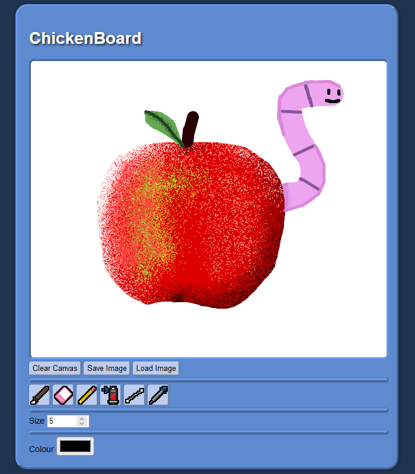

# ChickenBoard
A basic canvas-based drawing program.

Uses JavaScript and the HTML Canvas to provide a simple ms-paint like experience. The canvas can be saved as a .PNG image, and bitmap images can be loaded in to the canvas and drawn on.

A sample of ChickenBoard in action can be found on my personal website.